================================================================================
GDAL installation
================================================================================

This workshop requires GDAL 3.13.0, released May 2026.

The suggested installation procedure is to use GDAL Conda builds. Conda is a
system package management system that works on all major desktop operating system
(Linux, Windows, MacOS X). It is mainly aimed at the Python ecosystem, but with
a strong focus on tackling correctly the issue of software with native
dependencies such as GDAL.

Linux
-----

Conda installation
++++++++++++++++++

If you already have a Conda installation, skip that paragraph.

Download the Miniconda3 installer:

::

    $ curl -O https://repo.anaconda.com/miniconda/Miniconda3-latest-Linux-x86_64.sh

Install it:

::

    $ sh Miniconda3-latest-Linux-x86_64.sh

will output something like:

::

    Welcome to Miniconda3 py313_26.1.1-1

    In order to continue the installation process, please review the license
    agreement.
    Please, press ENTER to continue

Press Enter, then

::

    >>> 
    MINICONDA END USER LICENSE AGREEMENT

    Copyright Notice: Miniconda(R) (C) 2015, Anaconda, Inc.
    All rights reserved. Miniconda(R) is licensed, not sold.

    Redistribution and use in source and binary forms, with or without modification, are permitted provided that the following conditions are met:

    1. Redistributions of source code must retain the above copyright notice, this list of conditions and the following disclaimer;

    2. Redistributions in binary form must reproduce the above copyright notice, this list of conditions and the following disclaimer in the documentation and/or other materials provided w
    ith the distribution;

    3. The name Anaconda, Inc. or Miniconda(R) may not be used to endorse or promote products derived from this software without specific prior written permission from Anaconda, Inc.; and

    4. Miniconda(R) may not be used to access or allow third parties to access Anaconda package repositories if such use would circumvent paid licensing requirements or is otherwise restri
    cted by the Anaconda Terms of Service.

    DISCLAIMER: THIS SOFTWARE IS PROVIDED BY ANACONDA "AS IS" AND ANY EXPRESS OR IMPLIED WARRANTIES, INCLUDING, BUT NOT LIMITED TO, THE IMPLIED WARRANTIES OF MERCHANTABILITY, FITNESS FOR A
     PARTICULAR PURPOSE , AND NON-INFRINGEMENT ARE DISCLAIMED. IN NO EVENT SHALL ANACONDA BE LIABLE FOR ANY DIRECT, INDIRECT, INCIDENTAL, SPECIAL, EXEMPLARY, OR CONSEQUENTIAL DAMAGES (INCL
    UDING, BUT NOT LIMITED TO, PROCUREMENT OF SUBSTITUTE GOODS OR SERVICES; LOSS OF USE, DATA, OR PROFITS; OR BUSINESS INTERRUPTION) HOWEVER CAUSED AND ON ANY THEORY OF LIABILITY, WHETHER 
    IN CONTRACT, STRICT LIABILITY, OR TORT (INCLUDING NEGLIGENCE OR OTHERWISE) ARISING IN ANY WAY OUT OF THE USE OF MINICONDA(R), EVEN IF ADVISED OF THE POSSIBILITY OF SUCH DAMAGE.

    Do you accept the license terms? [yes|no]
    >>>

Answer "yes", or otherwise find another way of installing GDAL :-)

::

    Miniconda3 will now be installed into this location:
    /home/{YOUR_USE_NAME_HERE}/miniconda3

      - Press ENTER to confirm the location
      - Press CTRL-C to abort the installation
      - Or specify a different location below

    [/home/{YOUR_USE_NAME_HERE}/miniconda3] >>> 

Press ENTER to confirm.

::

    PREFIX=/home/{YOUR_USE_NAME_HERE}/miniconda3
    Unpacking bootstrapper...
    Unpacking payload...

    Installing base environment...

    Downloading and Extracting Packages:

    ## Package Plan ##

      environment location: /home/{YOUR_USE_NAME_HERE}/miniconda3

      added / updated specs:
        - pkgs/main/linux-64::_libgcc_mutex==0.1=main
          [ ... snip ... ]
        - pkgs/main/noarch::tzdata==2025c=he532380_0

    The following NEW packages will be INSTALLED:

      _libgcc_mutex      pkgs/main/linux-64::_libgcc_mutex-0.1-main 
          [ ... snip ... ]
      zstd               pkgs/main/linux-64::zstd-1.5.7-h11fc155_0 

    Downloading and Extracting Packages:

    Preparing transaction: done
    Executing transaction: done
    installation finished.
    Do you wish to update your shell profile to automatically initialize conda?
    This will activate conda on startup and change the command prompt when activated.
    If you'd prefer that conda's base environment not be activated on startup,
       run the following command when conda is activated:

    conda config --set auto_activate_base false

    Note: You can undo this later by running `conda init --reverse $SHELL`

    Proceed with initialization? [yes|no]
    [no] >>> 

For simplicity, do type "yes" (so against the suggestion)

::

    no change     /home/{YOUR_USE_NAME_HERE}/miniconda3/condabin/conda
    no change     /home/{YOUR_USE_NAME_HERE}/miniconda3/bin/conda
    no change     /home/{YOUR_USE_NAME_HERE}/miniconda3/bin/conda-env
    no change     /home/{YOUR_USE_NAME_HERE}/miniconda3/bin/activate
    no change     /home/{YOUR_USE_NAME_HERE}/miniconda3/bin/deactivate
    no change     /home/{YOUR_USE_NAME_HERE}/miniconda3/etc/profile.d/conda.sh
    no change     /home/{YOUR_USE_NAME_HERE}/miniconda3/etc/fish/conf.d/conda.fish
    no change     /home/{YOUR_USE_NAME_HERE}/miniconda3/shell/condabin/Conda.psm1
    no change     /home/{YOUR_USE_NAME_HERE}/miniconda3/shell/condabin/conda-hook.ps1
    no change     /home/{YOUR_USE_NAME_HERE}/miniconda3/lib/python3.13/site-packages/xontrib/conda.xsh
    no change     /home/{YOUR_USE_NAME_HERE}/miniconda3/etc/profile.d/conda.csh
    modified      /home/{YOUR_USE_NAME_HERE}/.bashrc

    ==> For changes to take effect, close and re-open your current shell. <==

    Thank you for installing Miniconda3!

As suggested, start a new terminal or source the updated :file:`~/.bahsrc`.

.. _install_gdal_linux:

GDAL installation in a dedicated conda environment
++++++++++++++++++++++++++++++++++++++++++++++++++

First, we will create a Conda "environment" for the purpose of this workshop,
and will call it "gdal". A Conda environment is a kind of workspace where you
can install a set of packages that will not interfere with the ones of other
environments. We use the "conda-forge" channel to get up-to-date official releases
from the conda community.

::

    $ conda create --name gdal -c conda-forge
    Retrieving notices: done
    Channels:
     - conda-forge
    Platform: linux-64
    Collecting package metadata (repodata.json): done
    Solving environment: done

    ==> WARNING: A newer version of conda exists. <==
        current version: 25.7.0
        latest version: 26.3.2

    Please update conda by running

        $ conda update -n base -c conda-forge conda

    ## Package Plan ##

      environment location: /home/{YOUR_USE_NAME_HERE}/miniconda3/envs/gdal

    Proceed ([y]/n)? y

Answer "y" and validate.

::

    Downloading and Extracting Packages:

    Preparing transaction: done
    Verifying transaction: done
    Executing transaction: done
    #
    # To activate this environment, use
    #
    #     $ conda activate gdal
    #
    # To deactivate an active environment, use
    #
    #     $ conda deactivate

    $ conda activate gdal

As suggested, you need to activate the newly created environment with:

::

    $ conda activate gdal

When an environment is activated, new lines in the shell are prefixed with "(name_of_environment)".

Let's update the base Conda environment to save a later warning:

::

     $ conda update -n base -c conda-forge conda

::

    Channels:
     - conda-forge
    Platform: linux-64
    Collecting package metadata (repodata.json): done
    Solving environment: done

    ==> WARNING: A newer version of conda exists. <==
        current version: 25.7.0
        latest version: 26.3.2

    Please update conda by running

        $ conda update -n base -c conda-forge conda

    ## Package Plan ##

      environment location: /home/{YOUR_USE_NAME_HERE}/miniconda3

      added / updated specs:
        - conda

    The following packages will be UPDATED:

      ca-certificates                      2026.2.25-hbd8a1cb_0 --> 2026.4.22-hbd8a1cb_0 
      openssl                                  3.6.1-h35e630c_1 --> 3.6.2-h35e630c_0 

    Proceed ([y]/n)? y

Answer "y" and validate.

::

    Downloading and Extracting Packages:

    Preparing transaction: done
    Verifying transaction: done
    Executing transaction: done

Now, we can finally install GDAL !

::

    (gdal) $ conda install gdal

::

    Channels:
     - conda-forge
    Platform: linux-64
    Collecting package metadata (repodata.json): done
    Solving environment: done

    ## Package Plan ##

      environment location: /home/{YOUR_USE_NAME_HERE}/miniconda3/envs/gdal

      added / updated specs:
        - gdal

    The following packages will be downloaded:

        package                    |            build
        ---------------------------|-----------------
        ca-certificates-2026.4.22  |       hbd8a1cb_0         128 KB  conda-forge
        gdal-3.13.0                |  py314hd76b233_4         1.8 MB  conda-forge
        [ ... snip ...]
        zlib-1.3.2                 |       h25fd6f3_2          94 KB  conda-forge
        ------------------------------------------------------------
                                               Total:        77.5 MB

    The following NEW packages will be INSTALLED:

      _openmp_mutex      conda-forge/linux-64::_openmp_mutex-4.5-20_gnu 
      [ ... snip ...]
      zstd               conda-forge/linux-64::zstd-1.5.7-hb78ec9c_6 

    Proceed ([y]/n)? y

Answer "y" and validate.

::

    Downloading and Extracting Packages:

    Preparing transaction: done
    Verifying transaction: done
    Executing transaction: done

Now let's check we got the GDAL we expected:

::

    $ gdal --version

::

    GDAL 3.13.0 "Iowa City", released 2026/05/04

MacOS X
-------

.. note:: The instructions for MacOS X are a bit succinct, due to lack of access to that platform.

Conda installation
++++++++++++++++++

If you already have a Conda installation, skip that paragraph.
Otherwise follow the instructions at https://www.anaconda.com/docs/getting-started/miniconda/install/mac-gui-install

GDAL installation in a dedicated conda environment
++++++++++++++++++++++++++++++++++++++++++++++++++

Please follow :ref:`Linux instructions <install_gdal_linux>` which should apply to MacOS X as well.

Windows
-------

(tested on Windows 10, hopefully valid for Windows 11)

Conda installation
++++++++++++++++++

If you already have a Conda installation, skip that paragraph.

Download the Miniconda3 installer at https://repo.anaconda.com/miniconda/Miniconda3-latest-Windows-x86_64.exe

And execute it as an administrator, typically by right-clicking on the executable file and select "Run as administrator".
Running as administrator is to make sure that you have permissions to install into :file:`c:\\gdal` so that later instructions can be applied without modification.

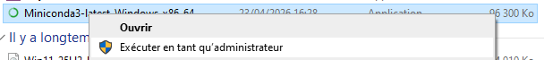

Validate the Welcome dialog:

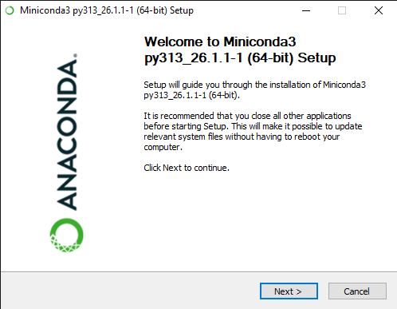

Accept the license agreement:

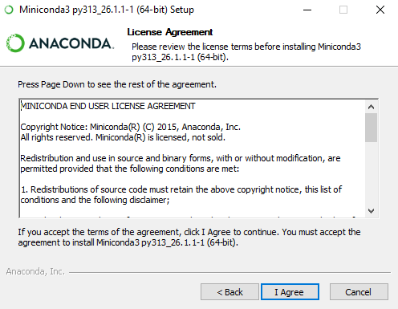

Select "Just Me" and validate:

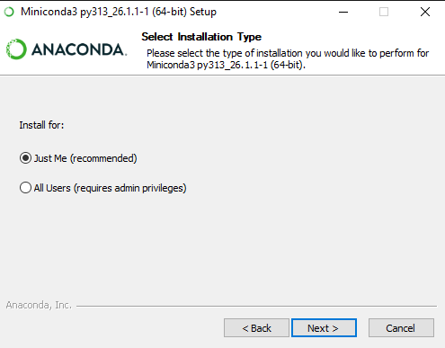

Modify the install path to :file:`c:\\gdal\\miniconda3` and validate:

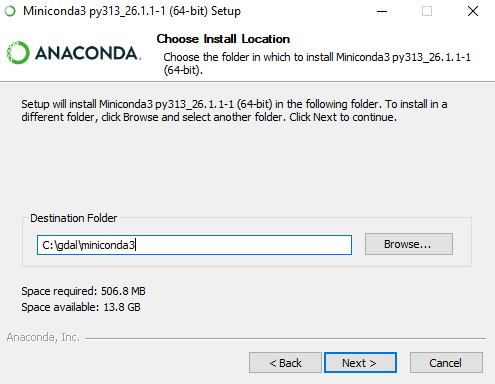

Only select "Create shortcuts" and click Install:

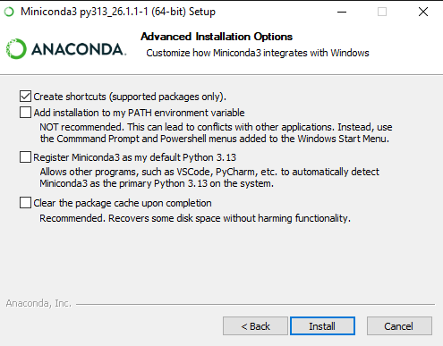

Once installation has completed, click Next:

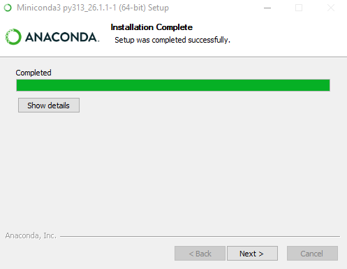

And finally click Finish:

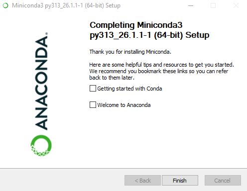

GDAL installation in a dedicated conda environment
++++++++++++++++++++++++++++++++++++++++++++++++++

First, let's start a Conda enabled command line.

From the Start Menu, select "Anaconda Prompt"

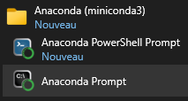

which will open a :file:`cmd` console with Conda executables available in the PATH.

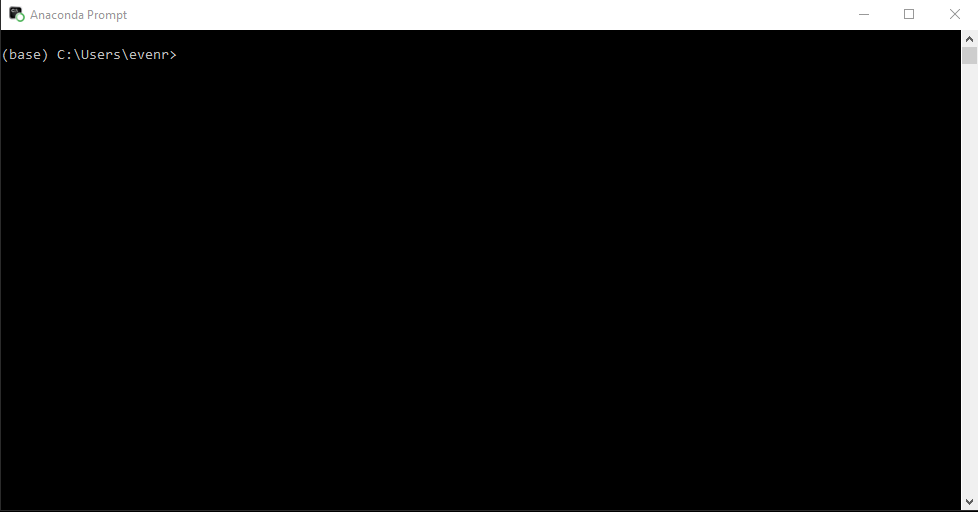

Then we will create a Conda "environment" for the purpose of this workshop,
and will call it "gdal", an install it into :file:`c:\\gdal\\condaenv\`\gdal`.
A Conda environment is a kind of workspace where you
can install a set of packages that will not interfere with the ones of other
environments. We use the "conda-forge" channel to get up-to-date official releases
from the conda community.

::

    (base) C:\Users\my_user_name>conda create --prefix c:/gdal/condaenv/gdal -c conda-forge

::

    Do you accept the Terms of Service (ToS) for https://repo.anaconda.com/pkgs/main? [(a)ccept/(r)eject/(v)iew]: a
    Do you accept the Terms of Service (ToS) for https://repo.anaconda.com/pkgs/r? [(a)ccept/(r)eject/(v)iew]: a
    Do you accept the Terms of Service (ToS) for https://repo.anaconda.com/pkgs/msys2? [(a)ccept/(r)eject/(v)iew]: a
    3 channel Terms of Service accepted
    Channels:
     - conda-forge
     - defaults
    Platform: win-64
    Collecting package metadata (repodata.json): done
    Solving environment: done

    ==> WARNING: A newer version of conda exists. <==
        current version: 26.1.1
        latest version: 26.3.2

    Please update conda by running

        $ conda update -n base -c defaults conda

    ## Package Plan ##

      environment location: c:\gdal\condaenv\gdal

    Proceed ([y]/n)?y

Answer "y" and validate.

::

    Downloading and Extracting Packages:

    Preparing transaction: done
    Verifying transaction: done
    Executing transaction: done
    #
    # To activate this environment, use
    #
    #     $ conda activate c:\gdal\condaenv\gdal
    #
    # To deactivate an active environment, use
    #
    #     $ conda deactivate

As suggested, you need to activate the newly created environment with:

::

    (base) C:\Users\my_user_name>conda activate c:\gdal\condaenv\gdal

When an environment is activated, new lines in the shell are prefixed with "(name_of_environment)".

::

    (c:\gdal\condaenv\gdal) C:\Users\my_user_name>conda install gdal
    3 channel Terms of Service accepted
    Channels:
     - conda-forge
     - defaults
    Platform: win-64
    Collecting package metadata (repodata.json): \
    3 channel Terms of Service accepted
    Channels:
     - conda-forge
     - defaults
    Platform: win-64
    Collecting package metadata (repodata.json): done
    Solving environment: done

    ==> WARNING: A newer version of conda exists. <==
        current version: 26.1.1
        latest version: 26.3.2

    Please update conda by running

        $ conda update -n base -c defaults conda

    ## Package Plan ##

      environment location: c:\gdal\condaenv\gdal

      added / updated specs:
        - gdal

    The following packages will be downloaded:

        package                    |            build
        ---------------------------|-----------------
        blosc-1.21.6               |       hfd34d9b_1          49 KB  conda-forge
        [ ... snip ... ]
        zstd-1.5.7                 |       h534d264_6         379 KB  conda-forge
        ------------------------------------------------------------
                                               Total:       180.9 MB

    The following NEW packages will be INSTALLED:

      blosc              conda-forge/win-64::blosc-1.21.6-hfd34d9b_1
      [ ... snip ... ]
      zstd               conda-forge/win-64::zstd-1.5.7-h534d264_6

    Proceed ([y]/n)?y

Answer "y" and validate.

::

    [ ... displaying packages in download ... ]

    Downloading and Extracting Packages:

    Preparing transaction: done
    Verifying transaction: done
    Executing transaction: done

Now let's check we got the GDAL we expected:

::

    (c:\gdal\condaenv\gdal) C:\Users\my_user_name>gdal --version

::

    GDAL 3.13.0 "Iowa City", released 2026/05/04

Install a Bash shell
++++++++++++++++++++

The GDAL CLI comes with a powerful auto-completion mechanism, but this requires
it to be used from a Bash-compatible shell. In this paragraph, we will proceed
to installing such shell.

Download the MSYS2 installer at https://github.com/msys2/msys2-installer/releases/download/2026-03-22/msys2-x86_64-20260322.exe

And execute it as an administrator, typically by right-clicking on the executable file and select "Run as administrator".
Running as administrator is to make sure that you have permissions to install into :file:`c:\\gdal` so that later instructions can be applied without modification.

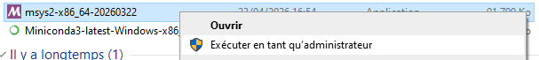

Click on Next:

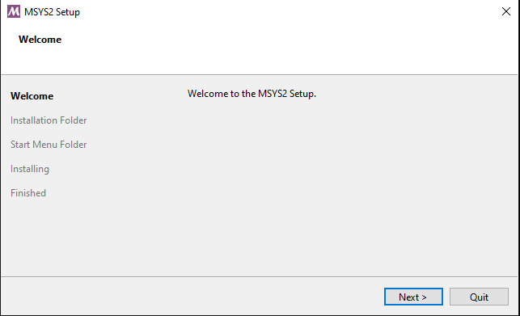

Specify :file:`c:\\gdal\\msys64`` as the installation folder and click on Next:

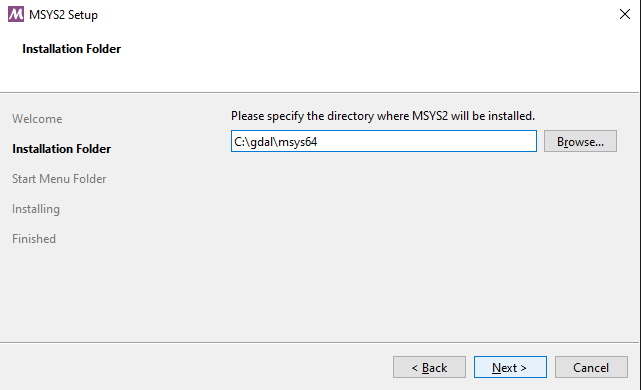

Specify "msys2_gdal" as the Start Menu folder and click on Next:

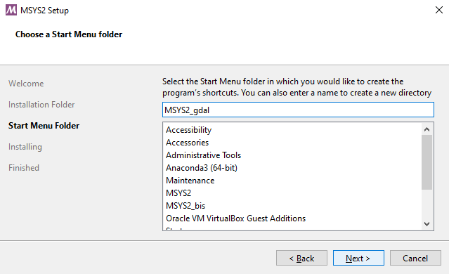

Click on Finish:

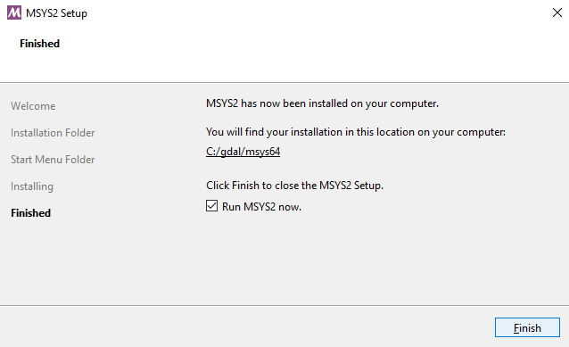

Create a launcher script
++++++++++++++++++++++++

Download the script at https://github.com/rouault/gdal_cli_workshop/blob/master/gdal.bat
and save it as :file:`c:\\gdal\\gdal.bat`. This script will launch a Bash shell
with all the necessary environment to run GDAL, include the command line completion.

Launch  :file:`c:\\gdal\\gdal.bat` from the Explorer or a shortcut you may have
created.

Type (``<TAB>`` means to press the TAB key):

::

    gdal --<TAB><TAB>

And you should see the following options to be proposed:

::

    --config      --drivers     --help        --json-usage  --version   
